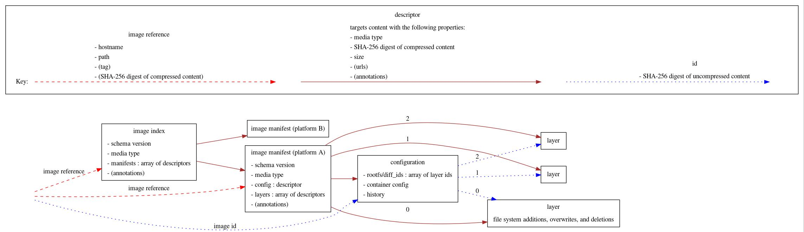

# go-containerregistry

## Introduction

This is a golang library for working with container registries.
It's largely based on the [Python library of the same name](https://github.com/google/containerregistry).

The following diagram shows the main types that this library handles.

## Philosophy

This library primarily revolves around an [`Image`](https://godoc.org/github.com/google/go-containerregistry/pkg/v1#Image)
interface (and to a lesser extent, [`ImageIndex`](https://godoc.org/github.com/google/go-containerregistry/pkg/v1#ImageIndex)
and [`Layer`](https://godoc.org/github.com/google/go-containerregistry/pkg/v1#Layer)).

There are a number of packages for reading/writing these interfaces from/to various formats.

The main focus has been registry interactions (hence the name) via the [`remote`](pkg/v1/remote) package,
but we have implemented other formats as we needed them to interoperate with various tools.

### `v1.Image`

#### Sources

* [`remote.Image`](https://godoc.org/github.com/google/go-containerregistry/pkg/v1/remote#Image)
* [`tarball.Image`](https://godoc.org/github.com/google/go-containerregistry/pkg/v1/tarball#Image)
* [`daemon.Image`](https://godoc.org/github.com/google/go-containerregistry/pkg/v1/daemon#Image)
* [`layout.Image`](https://godoc.org/github.com/google/go-containerregistry/pkg/v1/layout#Path.Image)
* [`random.Image`](https://godoc.org/github.com/google/go-containerregistry/pkg/v1/random#Image)

#### Sinks

* [`remote.Write`](https://godoc.org/github.com/google/go-containerregistry/pkg/v1/remote#Write)
* [`tarball.Write`](https://godoc.org/github.com/google/go-containerregistry/pkg/v1/tarball#Write)
* [`daemon.Write`](https://godoc.org/github.com/google/go-containerregistry/pkg/v1/daemon#Write)
* [`legacy/tarball.Write`](https://godoc.org/github.com/google/go-containerregistry/pkg/legacy/tarball#Write)
* [`layout.AppendImage`](https://godoc.org/github.com/google/go-containerregistry/pkg/v1/layout#Path.AppendImage)

### `v1.ImageIndex`

#### Sources

* [`remote.Index`](https://godoc.org/github.com/google/go-containerregistry/pkg/v1/remote#Index)
* [`random.Index`](https://godoc.org/github.com/google/go-containerregistry/pkg/v1/random#Index)
* [`layout.ImageIndexFromPath`](https://godoc.org/github.com/google/go-containerregistry/pkg/v1/layout#ImageIndexFromPath)

#### Sinks

* [`remote.WriteIndex`](https://godoc.org/github.com/google/go-containerregistry/pkg/v1/remote#WriteIndex)
* [`layout.Write`](https://godoc.org/github.com/google/go-containerregistry/pkg/v1/layout#Write)

### `v1.Layer`

#### Sources

* [`remote.Layer`](https://godoc.org/github.com/google/go-containerregistry/pkg/v1/remote#Layer)
* [`tarball.LayerFromFile`](https://godoc.org/github.com/google/go-containerregistry/pkg/v1/tarball#LayerFromFile)
* [`random.Layer`](https://godoc.org/github.com/google/go-containerregistry/pkg/v1/random#Layer)
* [`stream.Layer`](https://godoc.org/github.com/google/go-containerregistry/pkg/v1/stream#Layer)

#### Sinks

* [`remote.WriteLayer`](https://godoc.org/github.com/google/go-containerregistry/pkg/v1/remote#WriteLayer)

## Overview

### `mutate`

The simplest use for these libraries is to read from one source and write to another.

For example,

 * `crane pull` is `remote.Image -> tarball.Write`,
 * `crane push` is `tarball.Image -> remote.Write`,
 * `crane cp` is `remote.Image -> remote.Write`.

However, often you actually want to _change something_ about an image.
This is the purpose of the [`mutate`](pkg/v1/mutate) package, which exposes
some commonly useful things to change about an image.

### `partial`

If you're trying to use this library with a different source or sink than it already supports,
it can be somewhat cumbersome. The `Image` and `Layer` interfaces are pretty wide, with a lot
of redundant information. This is somewhat by design, because we want to expose this information
as efficiently as possible where we can, but again it is a pain to implement yourself.

The purpose of the [`partial`](pkg/v1/partial) package is to make implementing a `v1.Image`
much easier, by filling in all the derived accessors for you if you implement a minimal
subset of `v1.Image`.

### `transport`

You might think our abstractions are bad and you just want to authenticate
and send requests to a registry.

This is the purpose of the [`transport`](pkg/v1/remote/transport) and [`authn`](pkg/authn) packages.

## Tools

This repo hosts some tools built on top of the library.

### `crane`

[`crane`](cmd/crane/README.md) is a tool for interacting with remote images
and registries.

### `gcrane`

[`gcrane`](cmd/gcrane/README.md) is a GCR-specific variant of `crane` that has
richer output for the `ls` subcommand and some basic garbage collection support.

### `k8schain`

[`k8schain`](pkg/authn/k8schain/README.md) implements the authentication
semantics use by kubelets in a way that is easily consumable by this library.

`k8schain` is not a standalone tool, but it's linked here for visibility.

### Emeritus: [`ko`](https://github.com/google/ko)

This tool was originally developed in this repo but has since been moved to its
own repo.
