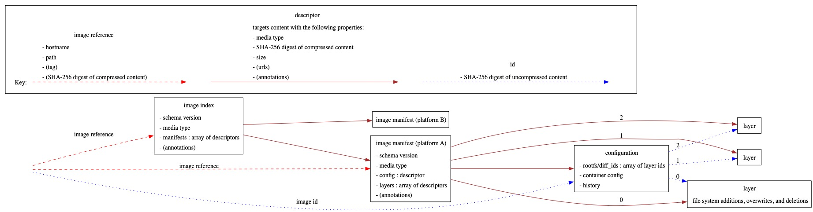

# go-containerregistry

[](https://travis-ci.org/google/go-containerregistry)
[](https://godoc.org/github.com/google/go-containerregistry)
[](https://goreportcard.com/report/google/go-containerregistry)
[](https://codecov.io/gh/google/go-containerregistry)


## Introduction

This is a golang library for working with container registries.
It's largely based on the [Python library of the same name](https://github.com/google/containerregistry).

The following diagram shows the main types that this library handles.


## Tools

This repo hosts some tools built on top of the library.

### `crane`

[`crane`](cmd/crane/doc/crane.md) is a tool for interacting with remote images
and registries.

#### Installation

```
GO111MODULE=on go get -u github.com/google/go-containerregistry/cmd/crane
```

#### Images

You can also use crane as docker image

```sh
$ docker run --rm gcr.io/go-containerregistry/crane ls ubuntu

2019/12/03 09:33:01 No matching credentials were found, falling back on anonymous
10.04
12.04.5
12.04
12.10
```

And it's also available with a shell, which uses the `debug` tag

```sh
docker run --rm -it --entrypoint "/busybox/sh" gcr.io/go-containerregistry/crane:debug
```

### `gcrane`

[`gcrane`](cmd/gcrane/README.md) is a GCR-specific variant of `crane` that has
richer output for the `ls` subcommand and some basic garbage collection support.

#### Installation

```
GO111MODULE=on go get -u github.com/google/go-containerregistry/cmd/gcrane
```

#### Images

You can also use gcrane as docker image

```sh
$ docker run --rm gcr.io/go-containerregistry/gcrane ls ubuntu

2019/12/03 09:33:01 No matching credentials were found, falling back on anonymous
10.04
12.04.5
12.04
12.10
```

And it's also available with a shell, which uses the `debug` tag

```sh
docker run --rm -it --entrypoint "/busybox/sh" gcr.io/go-containerregistry/gcrane:debug
```

### `k8schain`

[`k8schain`](pkg/authn/k8schain/README.md) implements the authentication
semantics use by kubelets in a way that is easily consumable by this library.

`k8schain` is not a standalone tool, but it's linked here for visibility.

### `Debug images for crane and gcrane`

`crane` and `gcrane` also provide a debug image (containing a shell), which can be found at

* gcr.io/go-containerregistry/crane:debug
* gcr.io/go-containerregistry/gcrane:debug

Inside these images, crane and gcrane can be used like this:

```sh
/ko-app/crane cp ...
```

### Emeritus: [`ko`](https://github.com/google/ko)

This tool was originally developed in this repo but has since been moved to its
own repo.
