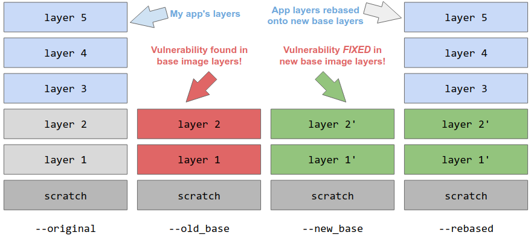

### This code is experimental and might break you if not used correctly.

The `rebase` command efficiently rewrites an image to replace the base image it
is `FROM` with a new base image.



([link](https://docs.google.com/drawings/d/1w8UxTZDRbDWVoqnbr17SJuU73pRxpOmOk_vzmC9WB2k/edit))

**This is not safe in general**, but it can be extremely useful for platform
providers, e.g. when a vulnerability is discovered in a base layer and many
thousands or millions of applications need to be patched in a short period of
time.

A commonly accepted guideline for rebase-safety is ABI-compatibility, but this
is still imperfect in a handful of ways, and the exact contract varies between
platform providers.

Rebasing is best suited for when rebuilding is either impossible (source is not
available) or impractical (too much work, too little time).

## Using `crane rebase`

For purposes of illustration, imagine you've built a container image
`my-app:latest`, which is `FROM ubuntu`:

```
FROM ubuntu

RUN ./very-expensive-build-process.sh

ENTRYPOINT ["/bin/myapp"]
```

A serious vulnerability has been found in the `ubuntu` base image, and a new
patched version has been released, tagged as `ubuntu:latest`.

You could build your app image again, and the Dockerfile's `FROM ubuntu`
directive would pick up the new base image release, but that requires a full
rebuild of your entire app from source, which might take a long time, and might
pull in other unrelated changes in dependencies.

You may have thousands of images containing the vulnerability. You just want to
release this critical bug fix across all your apps, as quickly as possible.

Instead, you could use `crane rebase` to replace the vulnerable base image
layers in your image with the patched base image layers, without requiring a
full rebuild from source.

```
$ crane rebase my-app:latest \
  --old_base=ubuntu@sha256:deadbeef... \
  --new_base=ubuntu:latest \
  --tag=my-app:rebased
```

This command:

1. fetches the manifest for the original image `my-app:latest`, and the
   `old_base` and `new_base` images
1. checks that the original image is indeed based on `old_base`
1. removes `old_base`'s layers from the original image
1. replaces them with `new_base`'s layers
1. computes and uploads a new manifest for the image, tagged as `--tag`.

If `--tag` is not specified, its value will be assumed to be the original
image's name. If the original image was specified by digest, the resulting
image will be pushed by digest only.

`crane rebase` will print the rebased image name by digest to `stdout`.

### Base Image Annotation Hints

The OCI image spec includes some [standard image
annotations](https://github.com/opencontainers/image-spec/blob/main/annotations.md)
that can provide hints for the `--old_base` and `--new_base` flag values, so
these don't need to be specified:

- **`org.opencontainers.image.base.digest`** specifies the original digest of
  the base image
- **`org.opencontainers.image.base.name`** specifies the original base image's
  reference

If the original image has these annotations, you can omit the `--old_base` and
`--new_base` flags, and their values will be assumed to be:

- `--old_base`: the `base.name` annotation value, plus the `base.digest`
  annotation value
- `--new_base`: the `base.name` annotation value

If these annotation values are invalid, and the flags aren't set, the operation
will fail.

Whether or not the annotation values were set on the original image, they
_will_ be set on the resulting rebased image, to ease future rebase operations
on that image.

`crane append` also supports the `--set-base-image-annotations` flag, which, if
true, will set these annotations on the resulting image.

## Caveats

The tool has no visibility into what the specific contents of the resulting
image, and has no idea what constitutes a "valid" image. As a result, it's
perfectly capable of producing an image that's entirely invalid garbage.
Rebasing arbitrary layers in an image is not a good idea.

To help prevent garbage images, rebasing should only be done at a point in the
layer stack between "base" layers and "app" layers. These should adhere to some
contract about what "base" layers can be expected to produce, and what "app"
layers should expect from base layers.

In the example above, for instance, we assume that the Ubuntu base image is
adhering to some contract with downstream app layers, that it won't remove or
drastically change what it provides to the app layer. If the `new_base` layers
removed some installed package, or made a breaking change to the version of
some compiler expected by the uppermost app layers, the resulting rebased image
might be invalid.

In general, it's a good practice to tag rebased images to some other tag than
the `original` tag, perform some confidence checks, then tag the image to the
`original` tag once it's determined the image is valid.

There is ongoing work to standardize and advertise base image contract
adherence to make rebasing safer.
