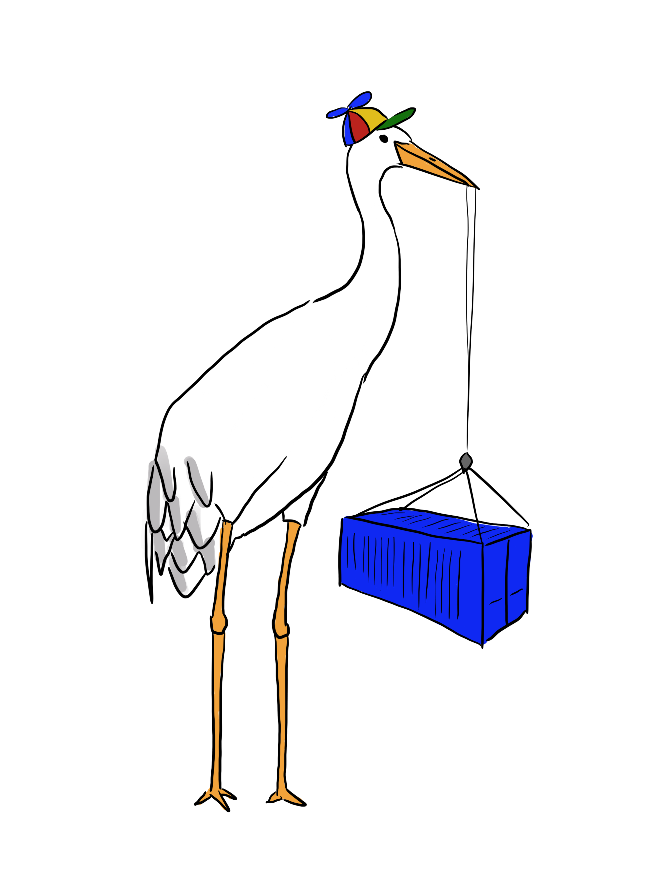

# `gcrane`



This tool implements a superset of the [`crane`](../crane/README.md) commands, with
additional commands that are specific to [gcr.io](https://gcr.io).

Note that this relies on some implementation details of GCR that are not
consistent with the [registry spec](https://docs.docker.com/registry/spec/api/),
so this may break in the future.

## Installation

Download [latest release](https://github.com/google/go-containerregistry/releases/latest).

Install manually:

```
go install github.com/google/go-containerregistry/cmd/gcrane@latest
```

## Commands

### ls

`gcrane ls` exposes a more complex form of `ls` than `crane`, which allows for
listing tags, manifests, and sub-repositories.

### cp

`gcrane cp` supports a `-r` flag that copies images recursively, which is useful
for backing up images, georeplicating images, or renaming images en masse.

### gc

`gcrane gc` will calculate images that can be garbage-collected.
By default, it will print any images that do not have tags pointing to them.

This can be composed with `gcrane delete` to actually garbage collect them:
```shell
gcrane gc gcr.io/${PROJECT_ID}/repo | xargs -n1 gcrane delete
```

## Images

You can also use gcrane as docker image

```sh
$ docker run --rm gcr.io/go-containerregistry/gcrane ls gcr.io/google-containers/busybox
gcr.io/google-containers/busybox@sha256:4bdd623e848417d96127e16037743f0cd8b528c026e9175e22a84f639eca58ff
gcr.io/google-containers/busybox:1.24
gcr.io/google-containers/busybox@sha256:545e6a6310a27636260920bc07b994a299b6708a1b26910cfefd335fdfb60d2b
gcr.io/google-containers/busybox:1.27
gcr.io/google-containers/busybox:1.27.2
gcr.io/google-containers/busybox@sha256:d8d3bc2c183ed2f9f10e7258f84971202325ee6011ba137112e01e30f206de67
gcr.io/google-containers/busybox:latest
```

And it's also available with a shell, at the `:debug` tag:

```sh
docker run --rm -it --entrypoint "/busybox/sh" gcr.io/go-containerregistry/gcrane:debug
```

Tagged debug images are available at `gcr.io/go-containerregistry/gcrane/debug:[tag]`.
