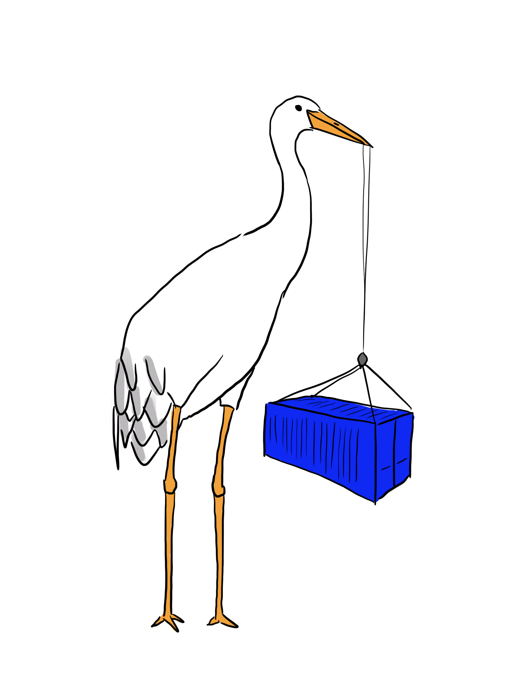

# `krane`

This tool is a variant of the [`crane`](../crane/README.md) command, but builds in
support for authenticating against registries using common credential helpers
that find credentials from the environment.

In particular this tool supports authenticating with common "workload identity"
mechanisms on platforms such as GKE and EKS.

This additional keychain logic only kicks in if alternative authentication
mechanisms have NOT been configured and `crane` would otherwise perform the
command without credentials, so **it is a drop-in replacement for `crane` that
adds support for authenticating with cloud workload identity mechanisms**.
