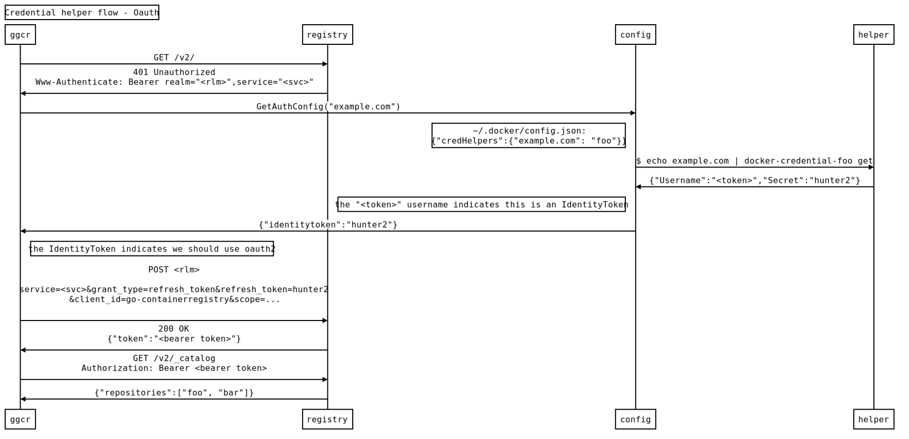

# `authn`

This README outlines how we acquire and use credentials when interacting with a registry.

As much as possible, we attempt to emulate docker's authentication behavior and configuration so that this library "just works" if you've already configured credentials that work with docker; however, when things don't work, a basic understanding of what's going on can help with debugging.

The official documentation for how docker authentication works is (reasonably) scattered across several different sites and GitHub repositories, so we've tried to summarize the relevant bits here.

## tl;dr for consumers of this package

By default, [`pkg/v1/remote`](https://godoc.org/github.com/google/go-containerregistry/pkg/v1/remote) uses [`Anonymous`](https://godoc.org/github.com/google/go-containerregistry/pkg/authn#Anonymous) credentials (i.e. _none_), which for most registries will only allow read access to public images.

To use the credentials found in your docker config file, you can use the [`DefaultKeychain`](https://godoc.org/github.com/google/go-containerregistry/pkg/authn#DefaultKeychain), e.g.:

```go
package main

import (
	"fmt"

	"github.com/google/go-containerregistry/pkg/authn"
	"github.com/google/go-containerregistry/pkg/name"
	"github.com/google/go-containerregistry/pkg/v1/remote"
)

func main() {
	ref, err := name.ParseReference("registry.example.com/private/repo")
	if err != nil {
		panic(err)
	}

	// Fetch the manifest using default credentials.
	img, err := remote.Get(ref, remote.WithAuthFromKeychain(authn.DefaultKeychain))
	if err != nil {
		panic(err)
	}

	// Prints the digest of registry.example.com/private/repo
	fmt.Println(img.Digest)
}
```

(If you're only using [gcr.io](https://gcr.io), see the [`pkg/v1/google.Keychain`](https://godoc.org/github.com/google/go-containerregistry/pkg/v1/google#Keychain), which emulates [`docker-credential-gcr`](https://github.com/GoogleCloudPlatform/docker-credential-gcr).)

## The Config File

This file contains various configuration options for docker and is (by default) located at:
* `$HOME/.docker/config.json` (on linux and darwin), or
* `%USERPROFILE%\.docker\config.json` (on windows).

You can override this location with the `DOCKER_CONFIG` environment variable.

### Plaintext

The config file is where your credentials are stored when you invoke `docker login`, e.g. the contents may look something like this:

```json
{
	"auths": {
		"registry.example.com": {
			"auth": "QXp1cmVEaWFtb25kOmh1bnRlcjI="
		}
	}
}
```

The `auths` map has an entry per registry, and the `auth` field contains your username and password encoded as [HTTP 'Basic' Auth](https://tools.ietf.org/html/rfc7617).

**NOTE**: This means that your credentials are stored _in plaintext_:

```bash
$ echo "QXp1cmVEaWFtb25kOmh1bnRlcjI=" | base64 -d
AzureDiamond:hunter2
```

For what it's worth, this config file is equivalent to:

```json
{
	"auths": {
		"registry.example.com": {
			"username": "AzureDiamond",
			"password": "hunter2"
		}
	}
}
```

... which is useful to know if e.g. your CI system provides you a registry username and password via environment variables and you want to populate this file manually without invoking `docker login`.

### Helpers

If you log in like this, docker will warn you that you should use a [credential helper](https://docs.docker.com/engine/reference/commandline/login/#credentials-store), and you should!

To configure a global credential helper:
```json
{
	"credsStore": "osxkeychain"
}
```

To configure a per-registry credential helper:
```json
{
	"credHelpers": {
		"gcr.io": "gcr"
	}
}
```

We use [`github.com/docker/cli/cli/config.Load`](https://godoc.org/github.com/docker/cli/cli/config#Load) to parse the config file and invoke any necessary credential helpers. This handles the logic of taking a [`ConfigFile`](https://github.com/docker/cli/blob/ba63a92655c0bea4857b8d6cc4991498858b3c60/cli/config/configfile/file.go#L25-L54) + registry domain and producing an [`AuthConfig`](https://github.com/docker/cli/blob/ba63a92655c0bea4857b8d6cc4991498858b3c60/cli/config/types/authconfig.go#L3-L22), which determines how we authenticate to the registry.

## Credential Helpers

The [credential helper protocol](https://github.com/docker/docker-credential-helpers) allows you to configure a binary that supplies credentials for the registry, rather than hard-coding them in the config file.

The protocol has several verbs, but the one we most care about is `get`.

For example, using the following config file:
```json
{
	"credHelpers": {
		"gcr.io": "gcr",
		"eu.gcr.io": "gcr"
	}
}
```

To acquire credentials for `gcr.io`, we look in the `credHelpers` map to find
the credential helper for `gcr.io` is `gcr`. By appending that value to
`docker-credential-`, we can get the name of the binary we need to use.

For this example, that's `docker-credential-gcr`, which must be on our `$PATH`.
We'll then invoke that binary to get credentials:

```bash
$ echo "gcr.io" | docker-credential-gcr get
{"Username":"_token","Secret":"<long access token>"}
```

You can configure the same credential helper for multiple registries, which is
why we need to pass the domain in via STDIN, e.g. if we were trying to access
`eu.gcr.io`, we'd do this instead:

```bash
$ echo "eu.gcr.io" | docker-credential-gcr get
{"Username":"_token","Secret":"<long access token>"}
```

### Debugging credential helpers

If a credential helper is configured but doesn't seem to be working, it can be
challenging to debug. Implementing a fake credential helper lets you poke around
to make it easier to see where the failure is happening.

This "implements" a credential helper with hard-coded values:
```
#!/usr/bin/env bash
echo '{"Username":"<token>","Secret":"hunter2"}'
```


This implements a credential helper that prints the output of
`docker-credential-gcr` to both stderr and whatever called it, which allows you
to snoop on another credential helper:
```
#!/usr/bin/env bash
docker-credential-gcr $@ | tee >(cat 1>&2)
```

Put those files somewhere on your path, naming them e.g.
`docker-credential-hardcoded` and `docker-credential-tee`, then modify the
config file to use them:

```json
{
	"credHelpers": {
		"gcr.io": "tee",
		"eu.gcr.io": "hardcoded"
	}
}
```

The `docker-credential-tee` trick works with both `crane` and `docker`:

```bash
$ crane manifest gcr.io/google-containers/pause > /dev/null
{"ServerURL":"","Username":"_dcgcr_1_5_0_token","Secret":"<redacted>"}

$ docker pull gcr.io/google-containers/pause
Using default tag: latest
{"ServerURL":"","Username":"_dcgcr_1_5_0_token","Secret":"<redacted>"}
latest: Pulling from google-containers/pause
a3ed95caeb02: Pull complete
4964c72cd024: Pull complete
Digest: sha256:a78c2d6208eff9b672de43f880093100050983047b7b0afe0217d3656e1b0d5f
Status: Downloaded newer image for gcr.io/google-containers/pause:latest
gcr.io/google-containers/pause:latest
```

## The Registry

There are two methods for authenticating against a registry:
[token](https://docs.docker.com/registry/spec/auth/token/) and
[oauth2](https://docs.docker.com/registry/spec/auth/oauth/).

Both methods are used to acquire an opaque `Bearer` token (or
[RegistryToken](https://github.com/docker/cli/blob/ba63a92655c0bea4857b8d6cc4991498858b3c60/cli/config/types/authconfig.go#L21))
to use in the `Authorization` header. The registry will return a `401
Unauthorized` during the [version
check](https://github.com/opencontainers/distribution-spec/blob/2c3975d1f03b67c9a0203199038adea0413f0573/spec.md#api-version-check)
(or during normal operations) with
[Www-Authenticate](https://tools.ietf.org/html/rfc7235#section-4.1) challenge
indicating how to proceed.

### Token

If we get back an `AuthConfig` containing a [`Username/Password`](https://github.com/docker/cli/blob/ba63a92655c0bea4857b8d6cc4991498858b3c60/cli/config/types/authconfig.go#L5-L6)
or
[`Auth`](https://github.com/docker/cli/blob/ba63a92655c0bea4857b8d6cc4991498858b3c60/cli/config/types/authconfig.go#L7),
we'll use the token method for authentication:


### OAuth 2

If we get back an `AuthConfig` containing an [`IdentityToken`](https://github.com/docker/cli/blob/ba63a92655c0bea4857b8d6cc4991498858b3c60/cli/config/types/authconfig.go#L18)
we'll use the oauth2 method for authentication:



This happens when a credential helper returns a response with the
[`Username`](https://github.com/docker/docker-credential-helpers/blob/f78081d1f7fef6ad74ad6b79368de6348386e591/credentials/credentials.go#L16)
set to `<token>` (no, that's not a placeholder, the literal string `"<token>"`).
It is unclear why: [moby/moby#36926](https://github.com/moby/moby/issues/36926).

We only support the oauth2 `grant_type` for `refresh_token` ([#629](https://github.com/google/go-containerregistry/issues/629)),
since it's impossible to determine from the registry response whether we should
use oauth, and the token method for authentication is widely implemented by
registries.
